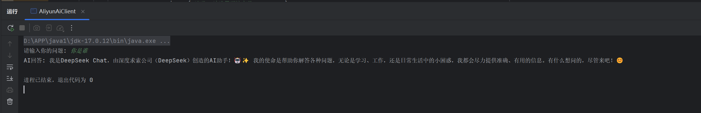
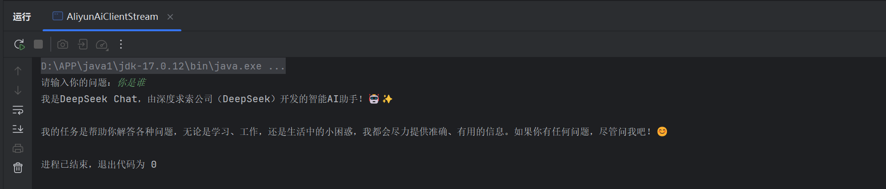
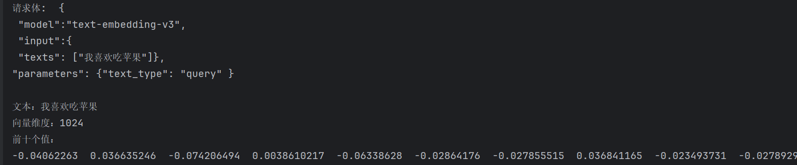

# 阿里云百炼 API Java 调用示例
本项目演示如何用 Java + OkHttp 调用阿里云百炼大模型 API，包含：
- 同步对话调用
- 流式对话调用（SSE，打字机效果）
- 文本向量化（Embedding）

## 技术栈

- Java 17
- OkHttp 4.12.0
- Jackson 2.16.1
- Maven

## 环境配置

1. 登录 [阿里云百炼控制台](https://bailian.console.aliyun.com/)
2. 开通服务，获取 API Key
3. 在 IDEA 运行配置中设置环境变量：
    - `Run` → `Edit Configurations` → `Environment variables`
    - 添加：`API_KEY=sk-你的真实Key`

## 项目结构
src/main/java/com/aliyun/ai/

├── AliyunAiClient.java // 同步调用

├── AliyunAiClientStream.java // 流式调用

└── EmbeddingDemo.java // 文本向量化

## 效果演示

同步调用

流式调用

向量化

